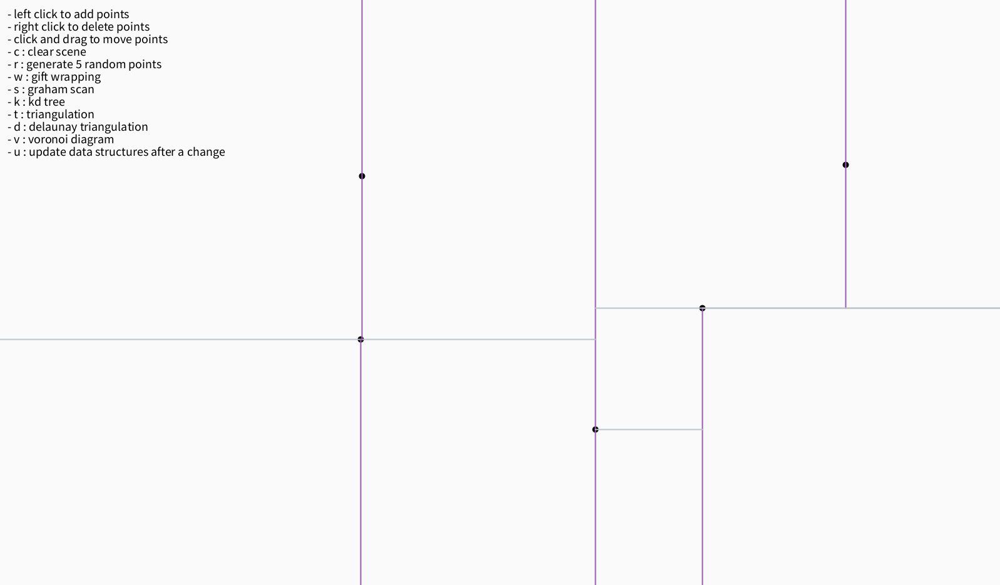
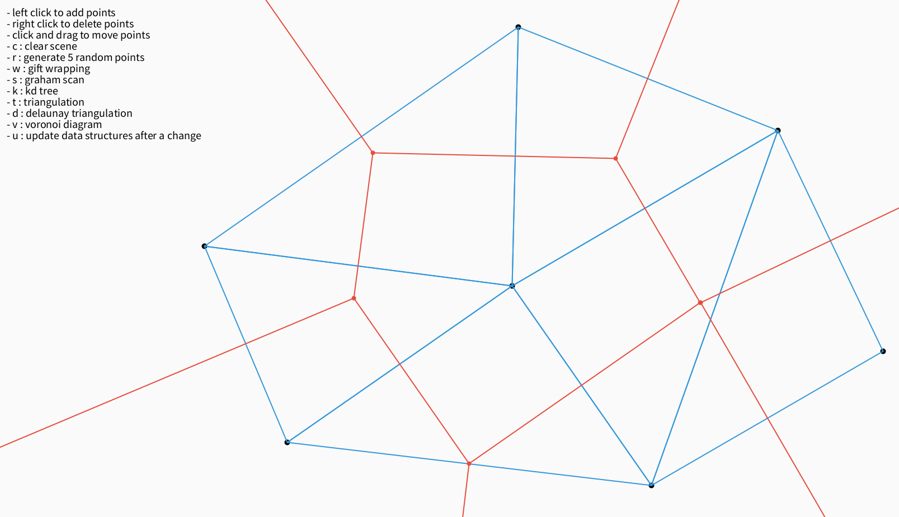

# Computational Geometry Project

Academic project implementing fundamental computational geometry algorithms and data structures:
- Convex Hull (Gift Wrapping, Graham Scan)
- Monotone Polygon Triangulation (sweep line algorithm)
- k-D Tree
- Delaunay Triangulation (incremental construction)
- Voronoi Diagram (derived from Delaunay Triangulation)

### k-D Tree

### Delaunay Triangulation (blue) & Voronoi Diagram (red)

